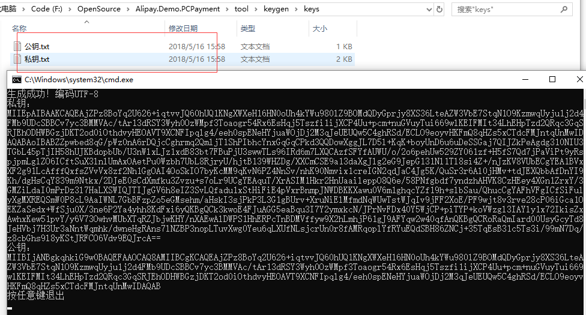

[](https://github.com/dotnetcore)  

#### 演示地址：https://zfbdemo.xcmaster.com/

# Alipay.AopSdk.Core

## 一.各个组件说明

组件名  | 说明 | 版本号 
-------- | :------------  | :------------ 
Alipay.AopSdk.Core | 服务端SDK，封装了支付宝开放平台的所有API  |  [](https://www.nuget.org/packages/Alipay.AopSdk.Core/)
Alipay.AopSdk.F2FPay  | 当面付SDK，提供条码支付、扫码支付能力  | [](https://www.nuget.org/packages/Alipay.AopSdk.F2FPay/) 
Alipay.AopSdk.AspnetCore  | 服务端SDK的ASP.NET Core组件，为了能更好配合ASP.NET Core 使用  | [](https://www.nuget.org/packages/Alipay.AopSdk.AspnetCore/) 
Alipay.AopSdk.F2FPay.AspnetCore  | 当面付SDK的ASP.NET Core组件，为了能更好配合ASP.NET Core 使用  | [](https://www.nuget.org/packages/Alipay.AopSdk.F2FPay.AspnetCore/) 

支付宝（Alipay）服务端SDK，采用.NET Standard 2.0，支持.NET Core 2.0，与官方SDK接口完全相同。完全可以按照官方文档进行开发。除了支持支付以外，官方SDK支持的功能本SDK全部支持，且用法几乎一样，代码都可参考官方文档代码。。由于精力有限，所以只做了几个Demo，但是其他功能可以参照官方的Demo来使用。可以使用官方文档中的示例代码。如有问题请加QQ群4656606。
>本项目代码基于官方.NET Framework 代码重构而来。

## 二.ASP.NET Core 使用

### 1.安装程序包

````
Install-Package Install-Package Alipay.AopSdk.AspnetCore
````

### 2.添加配置
````csharp
public void ConfigureServices(IServiceCollection services)
{
    services.AddAlipay(options =>
	        {
		        options.AlipayPublicKey = "支付宝公钥";
		        options.AppId = "应用ID";
		        options.CharSet = "密钥编码";
		        options.Gatewayurl = "支付网关";
		        options.PrivateKey = "商家私钥";
		        options.SignType = "签名方式 RSA/RSA2";
		        options.Uid = "商户ID";
	        });
}
````

### 3.在Controller中使用

````csharp
//通过di注入
private readonly IAlipayService  _alipayService;

public xxxController(IAlipayService alipayService)
{
	_alipayService = alipayService;

}

_alipayService.Execute();
````

## 三.使用当面付（条码支付/扫描支付）

### 1.安装程序包

````
Install-Package Alipay.AopSdk.F2FPay.AspnetCore
````

### 2.添加配置
````csharp
public void ConfigureServices(IServiceCollection services)
{
    services.AddAlipay(options =>
	        {
		        options.AlipayPublicKey = "支付宝公钥";
		        options.AppId = "应用ID";
		        options.CharSet = "密钥编码";
		        options.Gatewayurl = "支付网关";
		        options.PrivateKey = "商家私钥";
		        options.SignType = "签名方式 RSA/RSA2";
		        options.Uid = "商户ID";
	        }).AddAlipayF2F();
}
````
### 3.在Controller中使用

````csharp
private readonly IAlipayF2FService _alipayF2FService;

public xxxController(IAlipayF2FService alipayF2FService)
{
	_alipayF2FService = alipayF2FService;

}

_alipayF2FService.Execute();
````

## 四.配置

### 1.快捷添加配置的方法

在`appsettings.json`里添加如下信息

````json
 "Alipay": {
    "AlipayPublicKey": "",
    "AppId": "",
    "CharSet": "UTF-8",
    "Gatewayurl": "https://openapi.alipaydev.com/gateway.do",
    "PrivateKey": "",
    "SignType": "RSA2",
    "Uid": ""
  }
````

添加配置代码可改为如下：

````csharp
public void ConfigureServices(IServiceCollection services)
{
    //配置alipay服务
    ConfigureAlipay(services);
    services.AddMvc();
}

private void ConfigureAlipay(IServiceCollection services)
{
    var alipayOptions = Configuration.GetSection("Alipay").Get<AlipayOptions>();
    //检查RSA私钥
    AlipayConfigChecker.Check(alipayOptions.SignType, alipayOptions.PrivateKey);
    services.AddAlipay(options => options.SetOption(alipayOptions)).AddAlipayF2F();
}
````

### 2.在启动时进行私钥检查

通过方法`AlipayConfigChecker.Check`来在启动时对配置的私钥进行**格式**检查

````csharp
AlipayConfigChecker.Check(string signType,string privateKey)
````
该方法有两个参数第一个为签名算法类型，第二个为私钥。此方法作用为检查私钥是否有效。建议与注入配置的代码一致。

### 3.密钥生成的方法

解压tool文件夹下`keygen.zip`压缩包，运行`start.bat`即可在keys目录下生成公钥和私钥，长度为2048。

这里生成的公钥和私钥，只需将**私钥**配置到配置文件文件中，公钥需要设置到支付宝后台。然后设置`SignType`为`RSA2`。配置文件中的公钥配置，不是我们自己生成的这个，需要到支付宝后台获取，这里需要注意一下。




## 五.文档信息

官方文档：

- [支付宝开放平台文档](https://docs.open.alipay.com/54/103419 "支付宝开放平台文档")

### 1.演示Demo

>实现支付、支付同步回调、支付异步通知、订单查询、退款、退款查询、订单关闭、扫码支付功能

- [PC网站支付Demo](https://github.com/stulzq/Alipay.Demo.PCPayment "PC网站支付Demo")

- [扫码支付Demo](https://github.com/stulzq/Alipay.Demo.PCPayment "扫码支付Demo")

- [PC获取支付宝会员信息（网站使用支付宝登录）](http://www.cnblogs.com/liulun/p/8410870.html "PC获取支付宝会员信息（网站使用支付宝登录）")


### 2.教程

- [ASP.NET Core 2.0 使用支付宝PC网站支付](http://www.cnblogs.com/stulzq/p/7606164.html "ASP.NET Core 2.0 使用支付宝PC网站支付")

- [ASP.NET Core 2.0 支付宝当面付之扫码支付](http://www.cnblogs.com/stulzq/p/7647948.html "ASP.NET Core 2.0 支付宝当面付之扫码支付")

### 3.使用问题集锦

[常见问题解答](http://www.cnblogs.com/stulzq/p/7873909.html)

